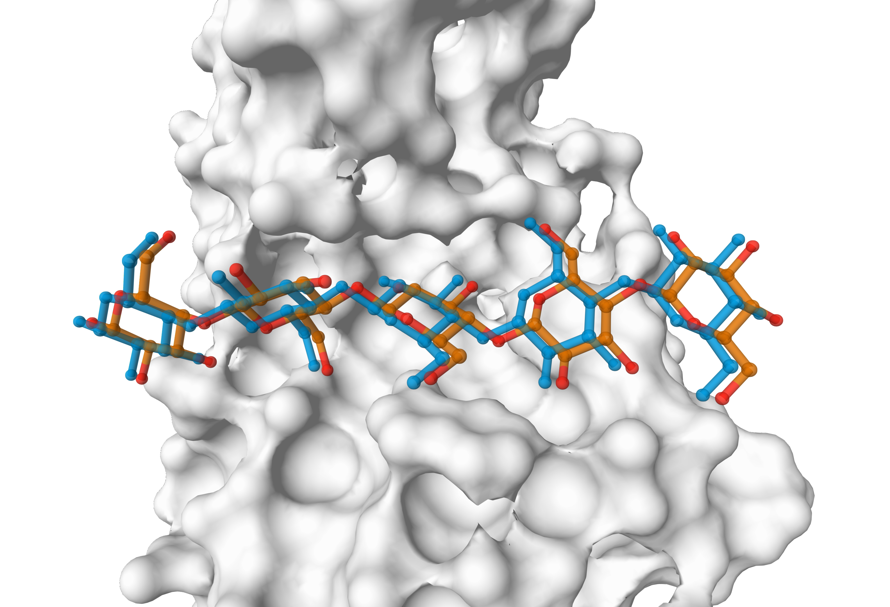
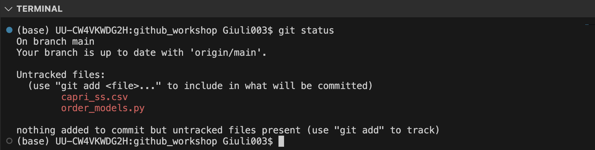

# github_workshop

## Exercise 0. Setting up personal access tokens

When using Github on the command line (as we will do throughout the tutorial), it is necessary to authenticate yourself. This is done by providing your personal access token instead of the password. This is a more secure way to authenticate yourself.

To create a personal access token:
- go to your github account
- click on your profile picture on the top-right corner
- select *Settings*
- click on *Developer settings*
- click on *Personal access tokens*
- click on *Generate new token*
- give a name to the token, and select the scopes you want to grant to the token. For the purpose of this workshop, you can select all the scopes.
- click on *Generate token*
- copy the token and save it in a safe place. You will not be able to see it again.

For more information on personal access tokens, check [this link](https://docs.github.com/en/authentication/keeping-your-account-and-data-secure/managing-your-personal-access-tokens#creating-a-personal-access-token-classic).

To use the token please check [how to use the token on the command line](https://docs.github.com/en/authentication/keeping-your-account-and-data-secure/managing-your-personal-access-tokens#using-a-personal-access-token-on-the-command-line). Basically, every time you want to clone/push/pull a repository, you will be asked for your credentials. Instead of providing your password, you will provide the token.

```bash
https://github.com/USERNAME/REPO.git
Username: YOUR-USERNAME
Password: YOUR-PERSONAL-ACCESS-TOKEN
```

To get rid of this annoying step, you can cache your credentials, as explained [in this example](https://docs.github.com/en/get-started/getting-started-with-git/caching-your-github-credentials-in-git).

## Exercise 1. Creating repositories, managing collaborators, and cloning

### Creating a repository
One group member has to create a repository in their own github account

- Go to **github.com/YOUR_USERNAME**
- select *Repositories*
- click *New* and choose a name for your repository (e.g. "github-tutorial", "my-first-github"). Avoid spaces in repository names
- leave the repository as public
- tick the Add a README file box: this will authomatically add an empty README file to your new project. 

**Tip**: for projects involving sensible data, it is advised to create a repository in *private* mode. It is anyway always possible to change the visibility of the repository later, for example when you are about to submit a research paper and you want to make the data available.

### Managing collaborators

Now your repository should have been created. In this situation the repository is public, and therefore visible to everyone, but the person who created it is the only allowed contributor. Let's see how we can easily add contributors:
- go to the main page of the repository
- click on *Settings->Collaborators*
- click on the `Add people` button
- you can now use the other members' github usernames to grant them full access to the repository.

### Cloning

The other group members should have received an e-mail with the details about the shared repository.

It's now time for all of you to have a copy of the online repository on your laptop.

- open the `terminal` on your laptop
- search the directory where you want to have your clone of the project (Desktop is also fine)
- Back to the browser: go to the main page of the repository
- click on the green **Code** button on the top-right side
- copy the link available under the `HTTPS` menu

- Back to the terminal, write down the following command:
  ```bash
  git clone https://github.com/YOUR_USERNAME/...
  ```

  Substitute this dummy address with the one you just copied. You will be asked for your credentials: once you provide them, the download will start and you will have a local copy of the repository on your laptop!

## Exercise 2. Add, Commit, Push

Now that we have a shared repository, let's add something to it.

In the `example` directory of this repository you will find a [very simple python script](example/order_models.py) (`order_models.py`) that reads [some data](example/capri_ss.csv) about possible models of a biomolecular complex, and ranks them according to a scoring function, built by combining three different features of the data. The lower the score, the better the model.


**Figure**: a good model (orange) of a complex would resemble as much as possible the experimental structure (here in blue). `order_models.py` tries to find the best way to rank different models.

The following instructions should be only executed by one group member. The others can have a look.

1. Download the script and the data files, and move them to the repository directory.
2. From the terminal, navigate to the repository directory.
3. Try the script to see it it works properly on your computer.
```bash
python order_models.py
```

You should see this output:
```bash
Model rank 1: model_36, score = -0.97
Model rank 2: model_28, score = -0.78
Model rank 3: model_35, score = -0.78
Model rank 4: model_26, score = -0.73
Model rank 5: model_25, score = -0.70
Model rank 6: model_47, score = -0.70
Model rank 7: model_108, score = -0.70
Model rank 8: model_29, score = -0.57
Model rank 9: model_37, score = -0.53
Model rank 10: model_34, score = -0.47
Model rank 11: model_31, score = -0.42
Model rank 12: model_169, score = -0.33
Model rank 13: model_64, score = -0.11
Model rank 14: model_91, score = -0.08
Model rank 15: model_88, score = 0.02
Model rank 16: model_86, score = 0.33
Model rank 17: model_61, score = 2.71
Model rank 18: model_118, score = 5.57
Model rank 19: model_210, score = 13.07
```

4. Once you're sure the script works, check for the changes within the repository
```bash
  git status
```
  This command will tell you the current state of the working directory. You should observe something similar to this:
  
  

5. add the script to the staging area:
```bash
  git add order_models.py
```
..and don't forget the data!
```bash
  git add capri_ss.csv
```
  and check again for differences
```bash
  git status
```
  You added something to the staging area!
  


  Nothing is definitive yet, you can in principle still apply local modifications to the file and re-add it.
  
6. You are now convinced of the changes you made, time to commit them.
```bash
  git commit -m "added python script and data"
```
   The commit just created a snapshot of the repository at this point in time. It is important to write down meaningful commit messages, so that other collaborators (and future versions of yourself) can have an idea of what you've done.

7. The commit you made is now available only on your local clone. It's time to push your changes to the remote.
```bash
  git push
```

The other group members can now update their own clones with the new content available on the remote
```bash
  git pull
```

## Exercise 3. Working in parallel. Issues, Branches, Pull Requests

You or one of your colleagues decide that the project needs some changes. In our research context, let's assume that this means refining and improving our approach according to the following features.

1. Our new score should contain the `bsa` (buried surface area) value, that should be weighted with a weight equal to `0.01` in our score;
2. unfortunately one model (`model_108`) has to be discarded, together with all the associated data (row), as we discovered that it was obtained with a wrong procedure;
3. our repository should contain a short piece of documentation to explain our approach to the problem.

#### Divide the tasks between the members of the group

### Issues
Every group member should create an issue about the desired feature
- go to the main page of the repository and click on `Issues`
- select `New issue`
- write a title and a description that briefly summarises the desired change
- Click on `Assign to yourself`, on the right side of the page: this means that you're responsible for this modification to the project. Knowing this, other collaborators will not work on the same feature at the same time.
- [Optional]: you can give a label to the issue by selecting one of the existing labels (on the right side of the page), or creating a new one


### Branching

It is now time to do the actual work!

Here you are developing a new feature, so you don't want your work to interfere with the main (production) branch and to become part of the project without being carefully checked. These are the reasons why we will here use the powerful concept of branches 

- using the terminal, navigate to your local clone of the repo
- first, make sure you have the most updated version of the project
```bash
  git pull
```
- let's create a new branch related to the feature. As an example, let's consider we're dealing with the documentation:
```bash
  git checkout -b create_docs
```
  This is a shortcut for the more complete
```bash
  git branch create_docs
  git checkout create_docs
```

- time to work now! Implement your feature as well as you can. Add and commit your changes whenever you think you reached an important point of the implementation. **Do not push the code yet**

- Is everything fine? Time to push the feature to the remote server.
```bash
  git push -u origin create_docs
```
Why not the standard git push here? The remote server does not know anything about the create_docs branch yet. With this command we specify that a branch create_docs should be created on the remote server, and that this should be connected to the create_docs branch available locally. Every future git pull/git push command on the local branch will fetch/deliver content to the linked remote branch.


*Notice how* **branch 'pr' set up to track 'origin/pr'>**

### Pull Requests and code review

The feature is now available on the remote server. It is time to merge it with the main branch. This is done through a Pull Request (PR).

- go to the main page of the repository

You should already see a message like this:


You can open the Pull Request by clicking on the *Compare & pull request* button. Add a title and a description to the PR, and click on *Create pull request*.

**Alternatively**:
- click on `Pull Requests`
- click on `New pull request`
- select the branch you want to merge into the main branch

The PR is now open. The other group members can now review the code, ask for changes, and approve the PR. Once the PR is approved, the branch can be **merged** into the main branch.

Within the PR page, you can see the changes made in the code via the *Files changed* tab. You can also browse the several commits that were made in the branch.

You can ask for a review by clicking on the `Reviewers` button on the right side of the page. Your collaborators should receive an e-mail with the request.
